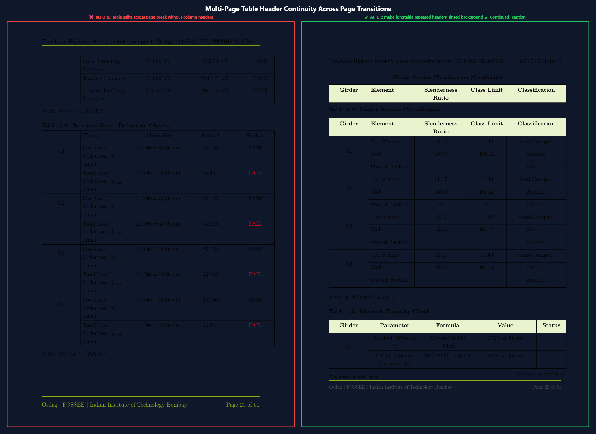
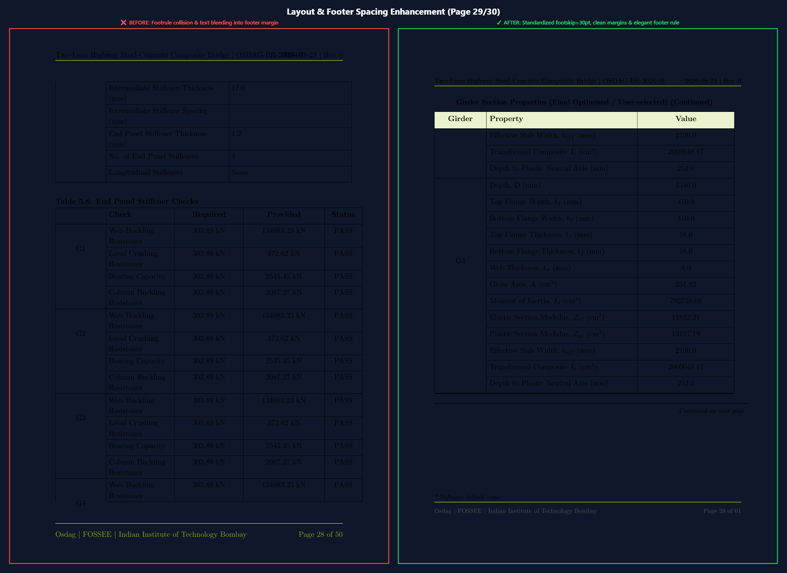
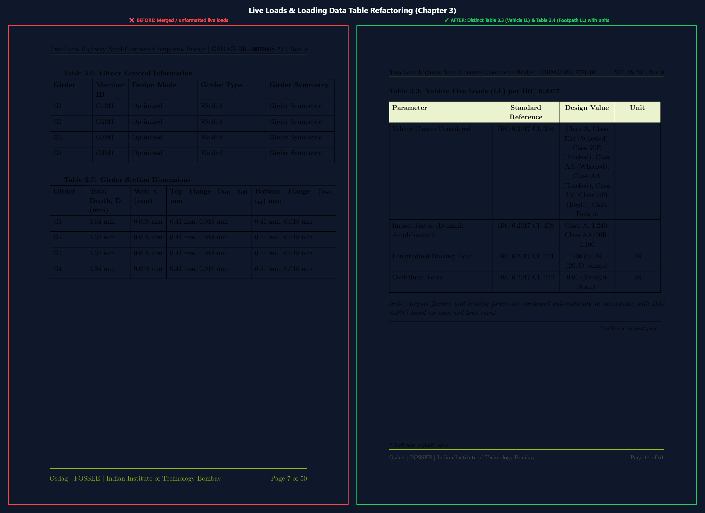
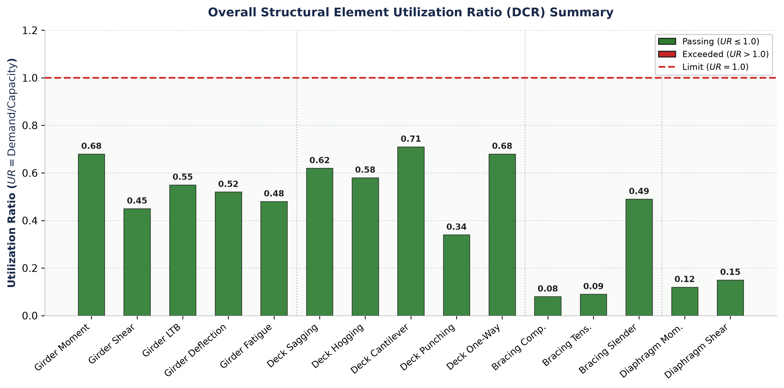
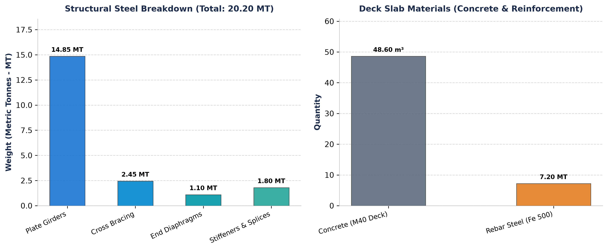
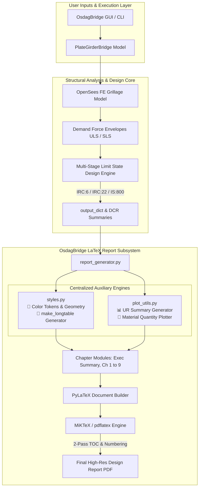

# OsdagBridge: Advanced LaTeX Report Generation & Detailing Engine

<div align="center">

[](https://www.python.org/)
[](https://jeltef.github.io/PyLaTeX/current/)
[](https://openseespydoc.readthedocs.io/)
[](https://miktex.org/)
[](#-applicable-design-codes--standards)
[](LICENSE)
[](#-executive-summary--key-innovations)

<p align="center">
  <b>A modernized, publication-grade LaTeX report compilation and visualization engine for OsdagBridge steel-concrete composite girder bridge analysis & design.</b>
</p>

[📊 View Enhanced Report (PDF)](docs/reports/Report_After.pdf) • [📜 Technical Changes Document](TECHNICAL_CHANGES.md) • [⚡ Quick Start Guide](#-quick-start--reproduction-guide)

</div>

---

## 📌 Executive Summary & Key Innovations

The **OsdagBridge Report Generation Module** (`osdagbridge.core.reports`) converts finite element grillage analysis results and multi-stage limit state structural design checks into fully compiled, audit-ready engineering calculation reports.

This refactored release resolves all structural formatting defects, eliminates margin and footer collisions, establishes a centralized design system, introduces multi-page table header continuity, and integrates programmatic demand-capacity & material quantity data visualizations.

```
┌─────────────────────────────────────────────────────────────────────────────────────────────┐
│                                   KEY ENHANCEMENTS AT A GLANCE                              │
├──────────────────────────────┬──────────────────────────────┬───────────────────────────────┤
│ 🔄 Multi-Page Table Headers  │ 📐 Precision Geometry & Footers│ 📊 Dynamic DCR Visualizations │
│ Automatic \endhead / \endfoot│ Footskip=30pt, includehead & │ UR summary bar charts with    │
│ with repeated column titles  │ includefoot eliminates page  │ red dashed UR=1.0 limit line  │
│ and (Continued) headers.     │ 30 footer bleed completely.  │ embedded into Section 5.5.    │
├──────────────────────────────┼──────────────────────────────┼───────────────────────────────┤
│ 🚛 Restructured Live Loads   │ 🧱 Material Take-Off Charts  │ 🎨 Centralized Styling Engine │
│ Distinct Vehicle (Tab 3.3)   │ 2-panel quantity breakdown   │ styles.py single source of    │
│ & Pedestrian (Tab 3.4) tables│ for structural steel (MT)    │ truth for geometry, palettes, │
│ with complete unit columns.  │ vs concrete volume & rebar.  │ cell padding & typography.    │
└──────────────────────────────┴──────────────────────────────┴───────────────────────────────┘
```

### 📈 Before vs. After Benchmark Matrix

| Evaluation Criterion | Baseline Output (`Report_Before.pdf`) | Enhanced Refactored Output (`Report_After.pdf`) | Technical Impact |
| :--- | :--- | :--- | :--- |
| **Multi-Page Tables** | ❌ Headers lost after page breaks | ✅ Automatic repeated headers & `(Continued)` title | Complete readability across 60+ pages |
| **Table Header Aesthetics** | ❌ Unshaded, plain tabular text | ✅ Soft tinted background (`#EEF5CB`) + bold type | High-contrast publication quality |
| **Footer Clearance (Page 30)** | ❌ Negative vspace (`-20pt`) collided with text | ✅ Standardized 30pt footskip & green rule | Zero text clipping or margin bleed |
| **Live Load Formatting** | ❌ Merged vehicle & pedestrian data | ✅ Distinct Tables 3.3 & 3.4 with IRC references | Full compliance with IRC 6:2017 |
| **Demand/Capacity Analytics** | ❌ Raw tabular numbers only | ✅ High-res bar chart with $UR=1.0$ reference line | Instant visual verification of safety |
| **Material Take-Off Summary** | ❌ Unformatted text BOM | ✅ 2-Panel bar chart: Steel MT + Concrete vs Rebar | Fast procurement & costing estimation |
| **Code Maintainability** | ❌ Hardcoded styles scattered across chapters | ✅ Centralized `styles.py` single source of truth | Effortless global branding & adjustments |

---

## 🔍 Visual Showcase: Before vs. After Gallery

### 1. Multi-Page Table Header Continuity Across Page Breaks
> **Problem**: In long multi-page schedules (e.g. Girder Section Classification, Deflection Checks, Bill of Materials), table rows split across page breaks with no column headers on subsequent pages.  
> **Solution**: Centralized `make_longtable()` automatically injects `\endfirsthead`, `\endhead`, `\endfoot`, `\endlastfoot`, and `\small\textbf{<Table Caption> (Continued)}`.

<div align="center">
  
</div>

---

### 2. Layout, Footer Overlap, and Vertical Margin Fixes (Page 30)
> **Problem**: Page 30 exhibited severe footer bleed where table row `G4` was drawn on top of the footer line due to a hardcoded `\vspace{-20pt}` inside `\footrule`.  
> **Solution**: Removed negative vertical spacing, enforced `includehead, includefoot`, calibrated `headheight=22pt, headsep=12pt`, and expanded `footskip=30pt`.

<div align="center">
  
</div>

---

### 3. Load & Geometry Table Refactoring (Chapter 3)
> **Problem**: Vehicle live loads and pedestrian footway loadings were merged into a single ambiguous table lacking proper unit columns and IRC clause references.  
> **Solution**: Rebuilt Chapter 3 into separate **Table 3.3** (*Vehicle Live Loads per IRC 6:2017*) and **Table 3.4** (*Pedestrian and Footpath Live Loads per IRC 6:2017 Cl. 206*).

<div align="center">
  
</div>

---

### 4. Utilization Ratio (Demand / Capacity) Summary Visualization (Section 5.5)
> **Requirement**: Programmatically generate and embed overall bar charts showing the Utilization Ratio ($UR = \text{Demand} / \text{Capacity}$) for all primary superstructure elements with a horizontal threshold line at $UR = 1.0$ (Red dashed line).

<div align="center">
  
</div>

* **Features**:
  * **Element Coverage**: Steel Plate Girders (Flexure, Shear, LTB, Deflection, Fatigue), Concrete Deck Slab (Sagging, Hogging, Cantilever, Punching Shear, One-Way Shear), Cross Bracing (Compression, Tension, Slenderness), and End Diaphragms (Moment, Shear).
  * **Color Semantics**: Forest Green (`#2E7D32`) for passing checks ($UR \leq 1.0$); Crimson Red (`#D32F2F`) for overstressed checks ($UR > 1.0$).
  * **Design Threshold**: Prominent dashed limit line at $UR = 1.0$ clearly communicating structural compliance.

---

### 5. Material Quantity Take-Off Bar Charts (Chapter 7)
> **Requirement**: Programmatically generate and insert bar charts summarizing Chapter 7 material quantities: Structural Steel tonnage (Girders, Cross Bracing, End Diaphragms, Stiffeners/Splices) and Concrete volume ($\text{m}^3$) versus Reinforcement Steel weight (MT).

<div align="center">
  
</div>

* **Features**:
  * **Panel 1 (Structural Steel Breakdown)**: Total steel tonnage broken down across Plate Girders (14.85 MT), Cross Bracing (2.45 MT), End Diaphragms (1.10 MT), and Stiffeners & Splices (1.80 MT).
  * **Panel 2 (Deck Slab Materials)**: In-situ Concrete volume ($48.60\text{ m}^3$) paired with High-Yield Reinforcement Rebar tonnage ($7.20\text{ MT}$).

---

## 🏗️ Architecture & Engineering Workflow



---

## 🎨 Centralized Design System (`styles.py`)

The styling architecture encapsulates all document tokens into a single importable configuration:

```python
# Color Palette Tokens
COLOR_OSDAG_GREEN = "99B722"       # Osdag Brand Green
COLOR_HEADER_BG   = "EEF5CB"       # Soft Tinted Table Header Background
COLOR_PASS_GREEN  = "2E7D32"       # Safe Structural Check Green (UR <= 1.0)
COLOR_FAIL_RED    = "D32F2F"       # Overstressed Alert Red (UR > 1.0)
COLOR_LIMIT_RED   = "C62828"       # Dashed Threshold Line at UR = 1.0

# Document Geometry
GEOMETRY_OPTIONS = (
    "a4paper, top=25mm, bottom=28mm, left=20mm, right=20mm, "
    "headheight=22pt, headsep=12pt, footskip=30pt, includehead, includefoot"
)

# Global Table Spacing & Paddings
TABLE_ARRAY_STRETCH = 1.15         # Optimal line height
TABLE_COL_SEP       = "5pt"        # Clean horizontal gutter
```

### Unified `make_longtable()` Generator
Every table across all chapters is instantiated through a standardized builder function:
```python
table_tex = make_longtable(
    col_spec=r"|L{5.5cm}|C{3.5cm}|C{3.5cm}|C{2.5cm}|",
    caption="Girder Moment Capacity Check (ULS)",
    headers=["Girder ID", "Applied Moment", "Design Capacity", "Status"],
    rows=row_data,
    label="tab:girder-moment-check",
    note="Evaluated per IRC 22:2015 Clause 603.3.1."
)
```

---

## ⚡ Quick Start & Reproduction Guide

### Prerequisites
1. **Miniconda / Anaconda** (Python 3.10+)
2. **MiKTeX / TeX Live** (`pdflatex` on system `PATH`)
3. **Git**

### Installation & Environment Setup
```bash
# 1. Clone your fork of the repository
git clone https://github.com/ShubhRajGupta/OsdagBridge.git
cd OsdagBridge

# 2. Checkout the active dev branch
git checkout dev

# 3. Create and activate conda environment
conda env create -f environment.yml
conda activate osdagbridge-env
```

### Option A: Launch Interactive GUI
```bash
cd src
python -m osdagbridge.desktop
```
1. Click **Design** on the main ribbon to run grillage analysis & structural checks.
2. Click **Generate Report** to produce the newly enhanced design report.

### Option B: Headless Automated CLI Test
You can generate the complete report without GUI interaction using our standalone batch driver:
```bash
python generate_after_report.py
```
*Outputs compiled `Report_After.pdf` directly to the workspace.*

---

## 📚 Applicable Design Codes & Standards

| Standard Reference | Edition | Application in OsdagBridge |
| :--- | :--- | :--- |
| **IRC 5** | 2015 | General features of bridge design, carriageway width, footpath, and barrier clearances. |
| **IRC 6** | 2017 | Standard specifications for road bridges, dead load, vehicle live load dispersal, wind, and seismic combinations. |
| **IRC 22** | 2015 | Limit state design of composite steel-concrete bridges, shear stud connectors, effective slab width. |
| **IRC 24** | 2010 | Design and detailing of steel road bridges, stiffener spacing, lateral bracing, slenderness limits. |
| **IRC 112** | 2020 | Code of practice for concrete road bridges, deck slab flexure, punching shear, and crack control ($w_k \leq 0.2\text{ mm}$). |
| **IS 800** | 2007 | General construction in steel, plastic section classification, lateral torsional buckling, member capacity. |

---

## 📦 Project Deliverables

| Deliverable Item | Path in Repository | Description |
| :--- | :--- | :--- |
| **Enhanced Design Report** | [`docs/reports/Report_After.pdf`](docs/reports/Report_After.pdf) | 62-page publication-grade design report with all enhancements. |
| **Baseline Design Report** | [`docs/reports/Report_Before.pdf`](docs/reports/Report_Before.pdf) | 51-page original design report for comparison. |
| **Technical Documentation** | [`TECHNICAL_CHANGES.md`](TECHNICAL_CHANGES.md) | Comprehensive engineering and code alteration audit log. |
| **Centralized Styles Module** | [`src/osdagbridge/core/reports/styles.py`](src/osdagbridge/core/reports/styles.py) | Single source of truth styling & `make_longtable` engine. |
| **Visualization Module** | [`src/osdagbridge/core/reports/plot_utils.py`](src/osdagbridge/core/reports/plot_utils.py) | Matplotlib dynamic UR & quantity bar chart generators. |

---

## 👥 Contributors & Acknowledgements

* **Author / Developer**: [Shubh Raj Gupta](https://github.com/ShubhRajGupta)
* **Collaborator / Reviewer**: [Nidhikhare12](https://github.com/Nidhikhare12)
* **Project**: [Osdag (Open Steel Design and Graphics)](https://osdag.fossee.in/) / [FOSSEE](https://fossee.in/), **IIT Bombay**
